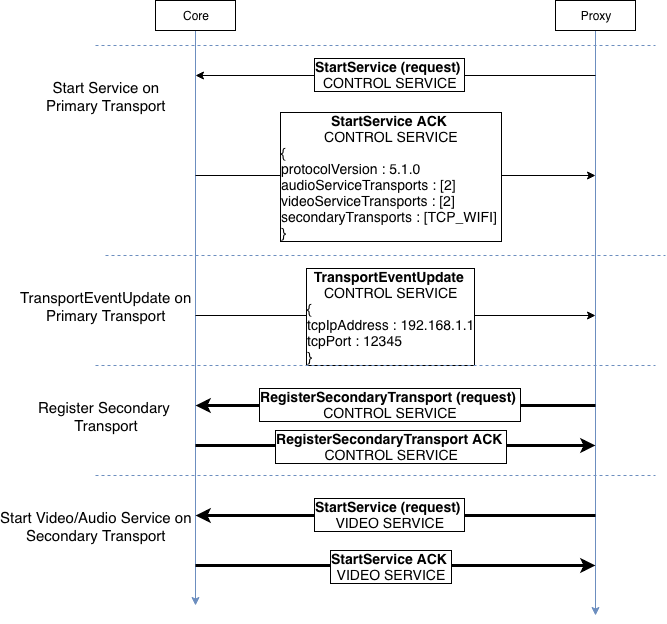
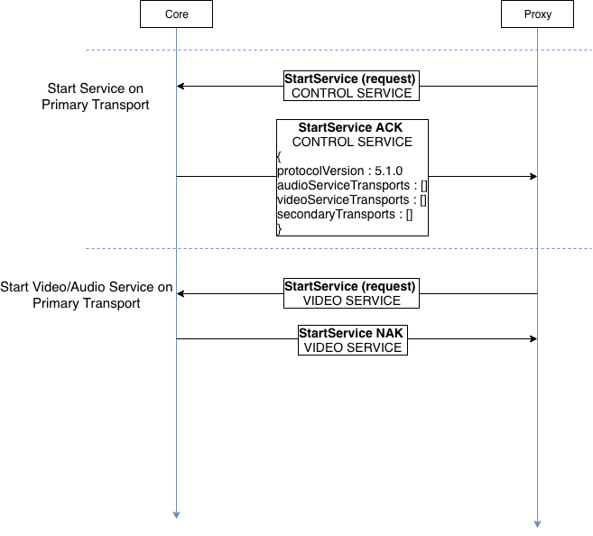
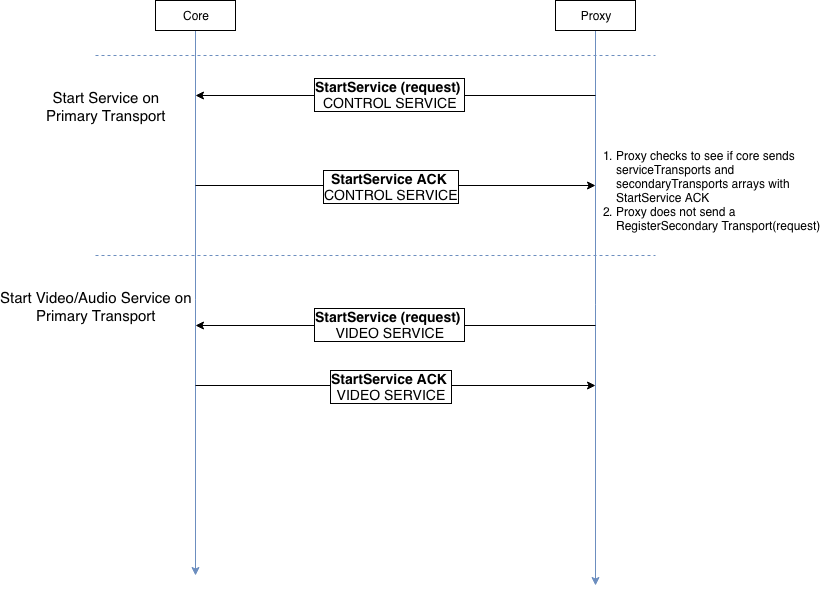
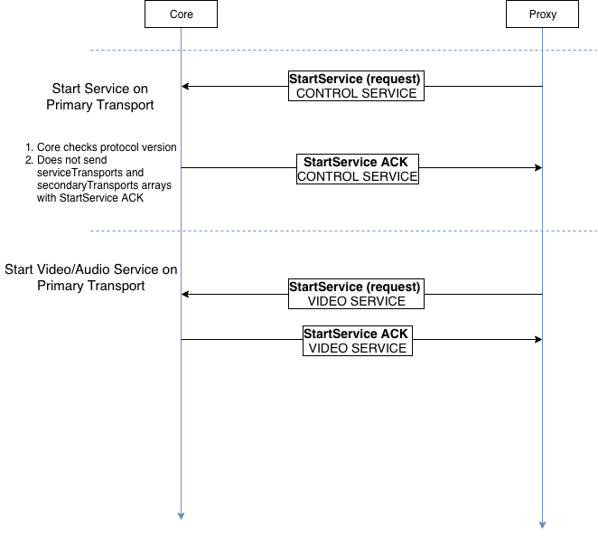
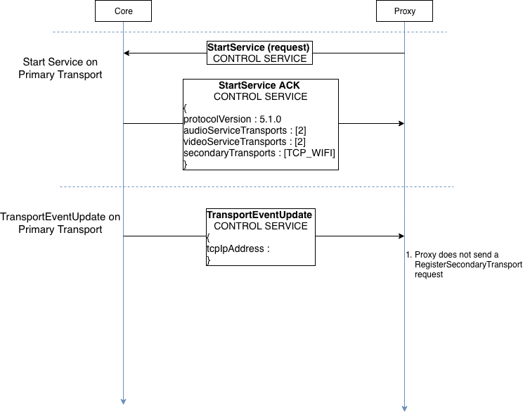

# General Description

The multiple transports feature allows apps connected to core to start another connection over a different transport for certain services(For example, the app connecting over bluetooth and then connecting over WiFi for video streaming). This guide will walk you through how to set up multiple transports using the `smartDeviceLink.ini` file.

## Implementation
- After Proxy is connected to Core, it initiates another connection over a different transport.
- Core tells Proxy which transport can be used as Secondary Transport.
- The services that are allowed on the Secondary Transport are specified by Core.

!!! Note

RPC and Hybrid services only run on the Primary Transport

!!!

Three protocol control frames are used to implement multiple transports

### `StartService ACK`
```
{
    	audioServiceTransports : [1, 2]
    	videoServiceTransports : [1, 2]
    	secondaryTransports : [TCP_WIFI]
}
```

Core responds to the proxy's `StartService` request with additional parameters audioServiceTransports, videoServiceTransports and secondaryTransports.   

- The secondaryTransports contains an array of the allowed secondary transports for the current primary transport. 
- AudioServiceTransports and videoServiceTransports describe which service is allowed to run on which transports (Primary, Secondary or both). The Proxy uses this information and starts services only on an allowed transport.
- Since RPC and Hybrid services always run on Primary Transport, only Video and Audio services are configurable.

### `TransportEventUpdate`
```
{
    tcpIpAddress : 192.168.1.1
    tcpPort : 12345
}
```

Core sends a TransportEventUpdate to the proxy to provide additional information required to connect to the secondary transport  

- In the case of TCP as the secondary transport, the TransportEventUpdate contains the `tcpIpAddress` and `tcpPort` params.
- If the `tcpIpAddress` field is empty, the secondary transport is unavailable and proxy will not send a RegisterSecondaryTransport request 

### `RegisterSecondaryTransport`

Using the information in the StartService ACK and TransportEventUpdate frames, the proxy sends a RegisterSecondary transport request over the secondary transport.  

- If core sends back a RegisterSecondaryTransport ACK, the proxy starts the service over the secondary transport

## Operation Examples
### Start Service(WiFi as secondary transport)  

|||
Figure 1

|||

### Start Video/Audio service(Over secondary transport)  

|||
Figure 2

|||

### Start Video/Audio service(No transport available)  

|||
Figure 3

|||

### Backwards Compatibility(New Proxy/Old Core)  

|||
Figure 4

|||

### Backwards Compatibility(Old Proxy/New Core)  

|||
Figure 5

|||

### TransportEventUpdate(Secondary Transport unavailable)  

|||
Figure 6

|||

# Setting up multiple transports

## Getting started

Add the following lines to `smartDeviceLink.ini`

- To enable multiple transports in core

```
[MultipleTransports]
...
MultipleTransportsEnabled = true
```

- To set the allowed Secondary Transport types for a given Primary transport

```
[MultipleTransports]
...
SecondaryTransportForBluetooth = WiFi
;SecondaryTransportForUSB =
;SecondaryTransportForWiFi =
```

**List of secondary transport types**

| String | Description |
| ------ | ----------- |
|IAP_BLUETOOTH |	iAP over Bluetooth|
|IAP_USB |	iAP over USB, and Core cannot distinguish between Host Mode and Device Mode.|
|IAP_USB_HOST_MODE |	iAP over USB, and the phone is running as host|
|IAP_USB_DEVICE_MODE |	iAP over USB, and the phone is running as device|
|IAP_CARPLAY|	iAP over Carplay wireless|
|SPP_BLUETOOTH|	Bluetooth SPP. Either legacy SPP or SPP multiplexing.|
|AOA_USB|	Android Open Accessory|
|TCP_WIFI|	TCP connection over Wi-Fi|


## Audio and Video streaming

Modify the services map in `smartdeviceLink.ini` to restrict video and audio streaming services to specific transport types.

```
[ServicesMap]
...
AudioServiceTransports = TCP_WIFI
VideoServiceTransports = TCP_WIFI, AOA_USB
```
- Transports are listed in preffered order
- If a transport is not listed, then the service is not allowed to run on that transport
- If the `AudioServiceTransports`/`VideoServiceTransports` line is omitted, service will be allowed to run on the primary transport
